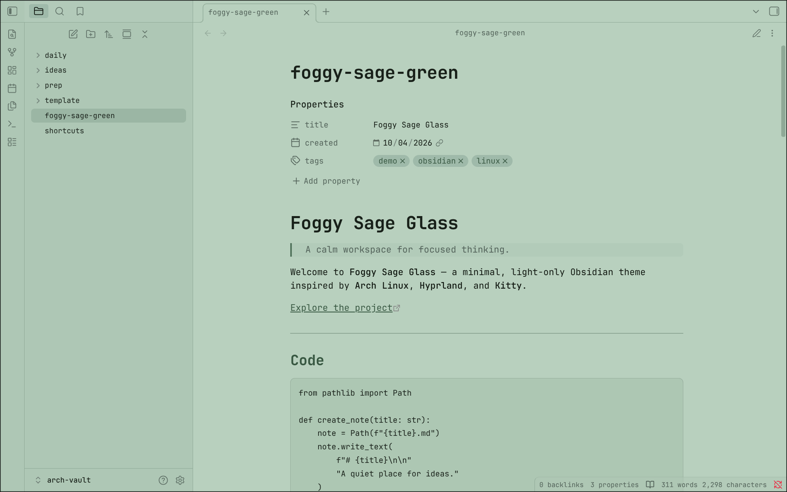

# foggy-sage-glass

A calm sage-green glass theme with a minimalist Arch Linux aesthetic.

## Description

Foggy Sage Glass is a minimal, light-only Obsidian theme built around a soft sage-green palette, dark typography, and translucent glass-inspired surfaces.

The theme is designed for a clean and calm writing environment while maintaining my minimalist Arch Linux aesthetic.

## Features

- 🌿 Soft sage-green glass aesthetic
- ⌨️ JetBrains Mono typography
- 🖥️ Minimal Arch Linux-inspired design

## Installation

### From Obsidian Community Themes

1. Open Obsidian.
2. Open **Settings**.
3. Go to **Appearance**.
4. Under **Themes**, select **Manage**.
5. Search for `Foggy Sage Glass`.
6. Select **Install and Use**.

### Manual Installation

1. Download `theme.css` and `manifest.json` from the latest release.
2. Create a folder named:

   `Foggy Sage Glass`

3. Place both files inside:

   `.obsidian/themes/Foggy Sage Glass/`

4. Open Obsidian.
5. Go to **Settings → Appearance**.
6. Select **Foggy Sage Glass**.

## License

[MIT](LICENSE) © Vishal V

## Credits

Inspired by my personal Kitty terminal configuration: [dotfiles](https://github.com/Vis-halV/dotfiles/)

**Kitty — Foggy Sage Glass**

Built for Obsidian.
